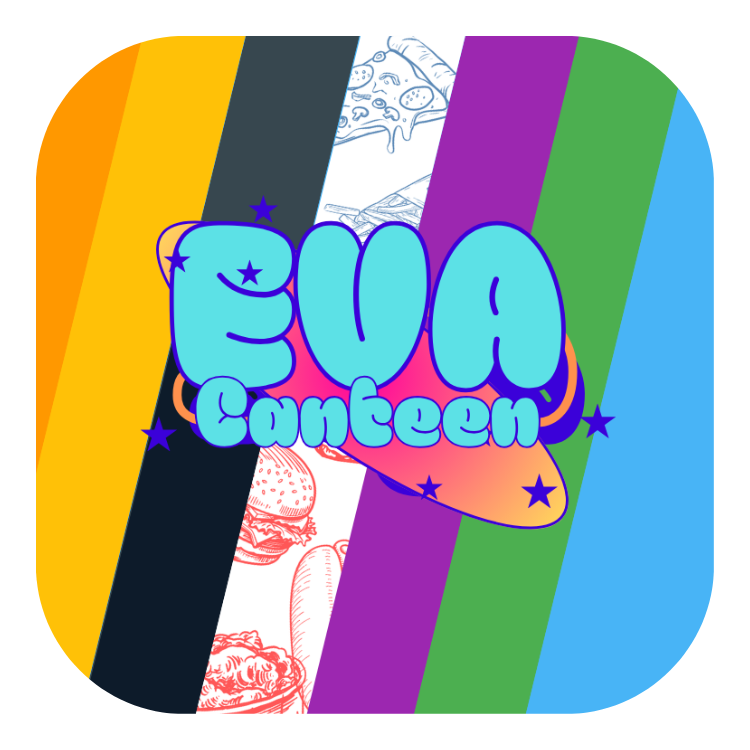

<div align="center">

  

  # EVA Canteen System

  <p>
    A modern, real-time web application for managing school canteen orders, inventory, and analytics.
    <br />
    Built with ❤️ by students at <strong>EVA International School for Applied Technology</strong>.
  </p>

  <p>
    <a href="#features">Features</a> •
    <a href="#tech-stack">Tech Stack</a> •
    <a href="#installation">Installation</a> •
    <a href="#usage">Usage</a> •
    <a href="#contributing">Contributing</a> •
    <a href="#license">License</a>
  </p>

  
  
  
  
  

</div>

---

## 📸 Screenshots & Demo

<div align="center">
  
</div>

<br />

<div align="center">
  
</div>

> **Note:** A full video demonstration will be added soon!

---

## 🚀 Overview

**EVA Canteen** is a comprehensive solution designed to streamline the ordering process in school cafeterias. It features a dual-interface system:
1.  **Student Interface:** Allows students to browse the menu, add items to their cart, and place orders seamlessly.
2.  **Admin Dashboard:** Empowers canteen staff to manage orders in real-time, update inventory, and view detailed sales analytics.

The application supports **English** and **Arabic** out of the box and features a robust theming engine with multiple color schemes and dark mode.

---

## ✨ Features

### 🛒 Ordering System
- **Real-time Updates:** Orders appear instantly on the admin dashboard thanks to WebSocket technology.
- **Smart Cart:** Easy-to-use shopping cart with total calculation and payment method selection (Cash/Card).
- **Discovery Mode:** Browse special bundles, meal ideas, and explore the menu in a visual, engaging way.

### 🛡️ Admin & Management
- **Dashboard:** A centralized hub to view active and archived orders.
- **Product Management:** Add, edit, and remove products with support for bilingual names and descriptions.
- **Category Management:** Drag-and-drop interface to reorder categories.
- **Inventory Tracking:** Set initial quantities and track stock levels automatically.
- **Currency Management:** Customize currency symbols (e.g., L.E, $, €) for both languages.

### 📊 Analytics
- **Visual Charts:** Interactive charts powered by `Chart.js` to visualize monthly orders.
- **Key Metrics:** Track Total Revenue, Total Orders, and Average Order Value.
- **Top Sellers:** Identify popular items to optimize inventory.

### 🎨 Customization
- **Bilingual Support:** Full English and Arabic UI translations.
- **Theming Engine:** Choose from over 10 themes including:
    - Default Blue, Light Blue, Light Red
    - Dark Grey, Night Mode (Dark Themes)
    - Monochrome, Yellow, Orange, Green, Purple
- **Responsive Design:** Works seamlessly on desktop and mobile devices.

---

## 🛠️ Tech Stack

- **Frontend:** HTML5, CSS3, Vanilla JavaScript, Chart.js
- **Backend:** Node.js, Express.js
- **Database:** SQLite (with `sqlite3` and `sqlite` wrapper)
- **Real-time:** `ws` (WebSocket library)
- **Security:** `bcrypt` (Password hashing), `jsonwebtoken` (Sessions/Auth)

---

## 📂 Project Structure

```bash
eva-canteen/
├── assets/                 # Static assets (images, profile pics)
├── data/                   # SQLite database (generated on runtime)
├── fonts/                  # Local font files
├── verification/           # Verification scripts/assets
├── database.js             # Database connection & schema setup
├── db_cli.js               # CLI tool for database queries
├── index.html              # Main frontend entry point (SPA)
├── package.json            # Project dependencies and scripts
├── server.js               # Main backend server (Express + WS)
├── script.js               # Frontend logic
└── style.css               # Global styles & themes
```

---

## 📦 Installation

1.  **Clone the repository:**
    ```bash
    git clone https://github.com/your-username/eva-canteen.git
    cd eva-canteen
    ```

2.  **Install dependencies:**
    ```bash
    npm install
    ```

3.  **Initialize the database (first run):**
    The application will automatically set up the SQLite database (`data/canteen.db`) on the first run.

4.  **Start the server:**
    ```bash
    npm start
    ```
    Or for development with auto-restart (if `nodemon` is installed):
    ```bash
    npm run dev
    ```

5.  **Access the app:**
    Open your browser and navigate to `http://localhost:8080` (or the port specified in your console).

---

## 🎮 Usage

### Admin Credentials
To access the Management Dashboard, use the following default credentials:

- **Email:** `admin@canteen.app`
- **Password:** `admin123`

> **Security Tip:** Please change these credentials immediately after deployment in a production environment.

### CLI Tools
The project includes a helper script for direct database interaction:

```bash
# Query the users table
node db_cli.js "SELECT * FROM users"
```

---

## 👥 Credits

Developed by the talented students at **EVA International School for Applied Technology**:

- **Eyad Gaber**
- **Anwar Qasem**
- **Dina Mahmoud**
- **Ahmed Mohamed**

---

## 📄 License

This project is licensed under the **GNU General Public License v3.0**. See the [LICENSE](LICENSE) file for details.

---

<div align="center">
  <sub>Built with pure dedication and lines of code.</sub>
</div>
